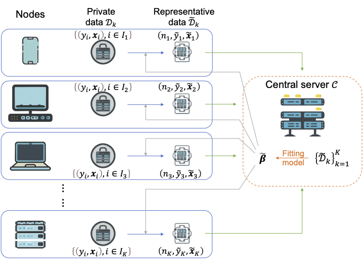

  
## Distributed AI via Representative Learning

Modern AI is increasingly **distributed**: data reside across devices, institutions, and regions.  
This creates fundamental challenges in:

- Data heterogeneity (non-IID distributions)
- Communication constraints
- Privacy and data localization
- Asynchronous systems

---

## A Data-Centric Paradigm

We develop **Representative Learning (RepL)**, a new framework for distributed machine learning.

Instead of sharing:
- model parameters  
- gradients  

RepL enables nodes to communicate **structured pseudo-data (“representatives”)**, preserving statistical structure while enabling efficient global learning.

---

## Why RepL?

- ✅ Communication-efficient (compact representations)  
- ✅ Model-agnostic (works across methods)  
- ✅ Privacy-aware (no raw data sharing)  
- ✅ Robust to heterogeneity  
- ✅ Naturally supports asynchronous systems  

---

## Research Overview

RepL is developed along three main directions:

### 1. Point Representatives (GLM & Smooth ERM)
- Mean Representative (MR)  
- Score-Matching Representative (SMR)  
- Response-Aided SMR (RASMR)  
- Transformed Mean Representative (TMR)  
- Anchored-SMR  

### 2. Non-Smooth Learning (Beyond GLMs)
- SVM and quantile regression  
- Clouded representatives (distribution-based learning)  

### 3. Extensions
- Functional data analysis  
- Asynchronous distributed learning  
- Collaborative learning frameworks  

---

## Visual Overview

  

<em>Representative Learning (RepL) framework for centralized build </em>

---

## Publications

See [Publications](publications.md) for a complete list. Recent work includes:

- *Representative Learning for Distributed Learning with Heterogeneity and Asynchrony* (JCGS)

## Professional Experience
See [Experience & Education](experience.md) for details.

## Talks
See [Talks](talks.md) for selected invited and conference talks.

---
